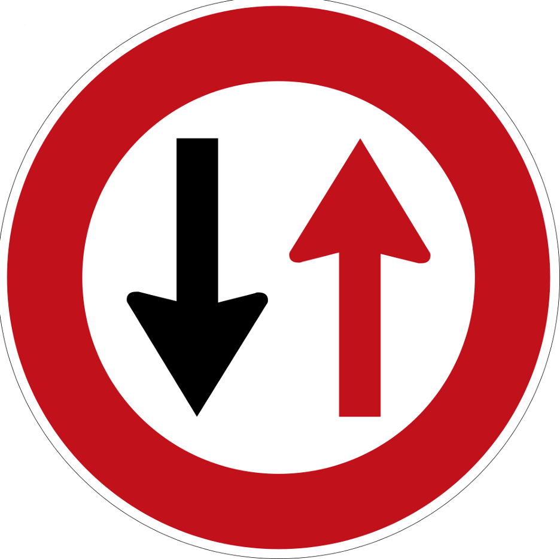

# Capstone Proposal

### Please edit this README.md file based on your Capstone project idea.

# Project 1 Title:
  Detecting wanted people in public places using computer vision.

#### Group Members:
- Razan Alyahya
- Rahaf Aladhyani
- Munirah Alsahly
- Waleed Almutairi

#### Objectives:
With the development of technology and the entry of artificial intelligence into our lives, we decided to build a project that helps the Competent Authorities to find the wanted people quickly and easily. The process of idintrying wanted people noww take a long time and effort to increase Security and Saftey in Saudi Arabia.

#### Dataset Description:
- Number of images in dataset is 200K images.

#### Dataset Link:
The project dataset is from Kaagle (we have two datasets  [1](https://www.kaggle.com/datasets/ashishjangra27/gender-recognition-200k-images-celeba) and [2](https://www.kaggle.com/datasets/almightyj/person-face-dataset-thispersondoesnotexist)), which contains different faces.....

#### The expected (Machine learning / Deep Learning) Algorithms:
Deep Learning

#### Links:
- https://ieeexplore.ieee.org/document/9377205
- https://www.researchgate.net/publication/353295394_Criminal_Identification_System_using_Facial_Recognition
- https://towardsdatascience.com/how-to-build-a-face-detection-and-recognition-system-f5c2cdfbeb8c
- https://www.youtube.com/watch?v=M5v2rXOalcw
- https://www.thalesgroup.com/en/markets/digital-identity-and-security/government/biometrics/facial-recognition

# Project 2 Title:
  Real-Time, Deep Learning Based Wrong Direction Detection.

#### Objectives:
In Hajj and Umrah, we sometimes go through periods of congestion, and the causes of congestion are many. One of the most common reasons is that the pilgrims do not adhere to walking in the correct direction, because there are people walking opposite the direction that causes congestion. In this project, we contribute to reducing congestion by informing the competent authorities about that.

#### Dataset Description:

#### Dataset Link:

#### The expected (Machine learning / Deep Learning) Algorithms:
Deep learning.

#### Links: 
- http://www.mikelrodriguez.com/crowd-analysis (for Project 2 and Project 3)
- http://www.mikelrodriguez.com/crowd-analysis
- https://www.mdpi.com/2076-3417/10/7/2453
- https://motchallenge.net/data/MOT20/
- https://youtu.be/Zn4BpUmrkoQ
- https://www.youtube.com/watch?v=Vo05vr8fc1U
- https://github.com/stijnh/scalable-crowd-analysis (We tried to open it but we get errors)
- https://github.com/ba-san/Crowd-Analysis-with-CNN (We tried to open it but we get errors)
- https://github.com/gjy3035/Awesome-Crowd-Counting#datasets (We tried to open it but we get errors)
- https://static1.squarespace.com/static/526150c2e4b0e2c92732b619/t/52667622e4b011999b2d023d/1382446626646/Rodriguez_ICCV_2009.pdf
- https://youtu.be/V9Hup-wImfA ()

# Project 3 Title:
  Crowd Density Estimation and Mapping

#### Objectives:
In Hajj and Umrah, we face the problem of overcrowding, and this may be the most common reason for poor organization, because all pilgrims performers may come from one side, and there are destinations that have not been used. In this project, we contribute to organizing the movement of pilgrims and Umrah performers.

#### Dataset Description:

#### Dataset Link:

#### The expected (Machine learning / Deep Learning) Algorithms:
Deep learning.

#### Links:
- https://medium.com/@kaamyakpant_67666/building-a-crowd-counting-model-using-deep-learning-e8b8e925674e
- https://www.youtube.com/watch?v=Tdfl1hQ1kNw
- https://www.mdpi.com/2220-9964/12/2/56
- https://www.semanticscholar.org/paper/Real-Time-Monitoring-for-Crowd-Counting-Using-Video-Song-Liu/5fa992f95b5420422f9338cae72c187a04b46ff0
- https://dorar.uqu.edu.sa/uquui/bitstream/20.500.12248/131782/2/Towards%20a%20Crowd%20Analytic.pdf
- http://iieng.org/images/proceedings_pdf/IAE1216012.pdf
- https://github.com/rummanwaqar/crowd-density-system (We tried to open it but we get errors)
- https://www.epfl.ch/labs/cvlab/research/crowd-counting/drone-head-plane/
- https://learnopencv.com/the-complete-guide-to-object-tracking-in-computer-vision/ (libraries in openCV for flow or tracking flow)

#### Final Deliverables:
- README.md file.

#### Due Date: Fri, 17 Feb, at 11:00 a.m.
